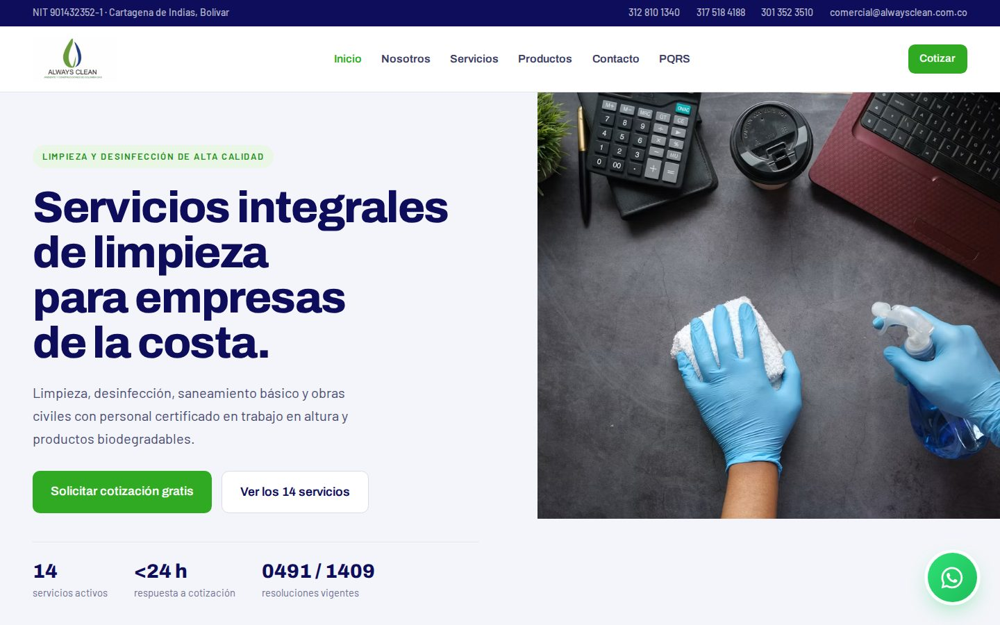
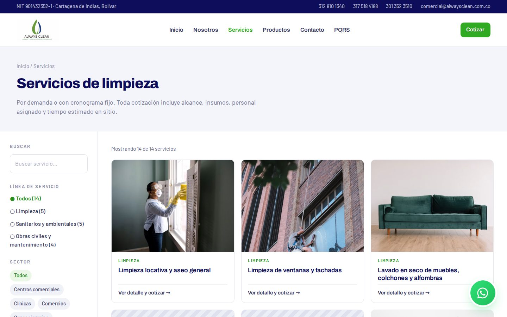
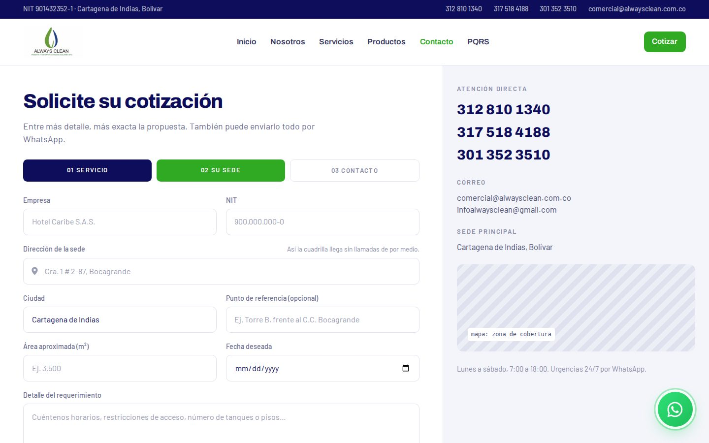
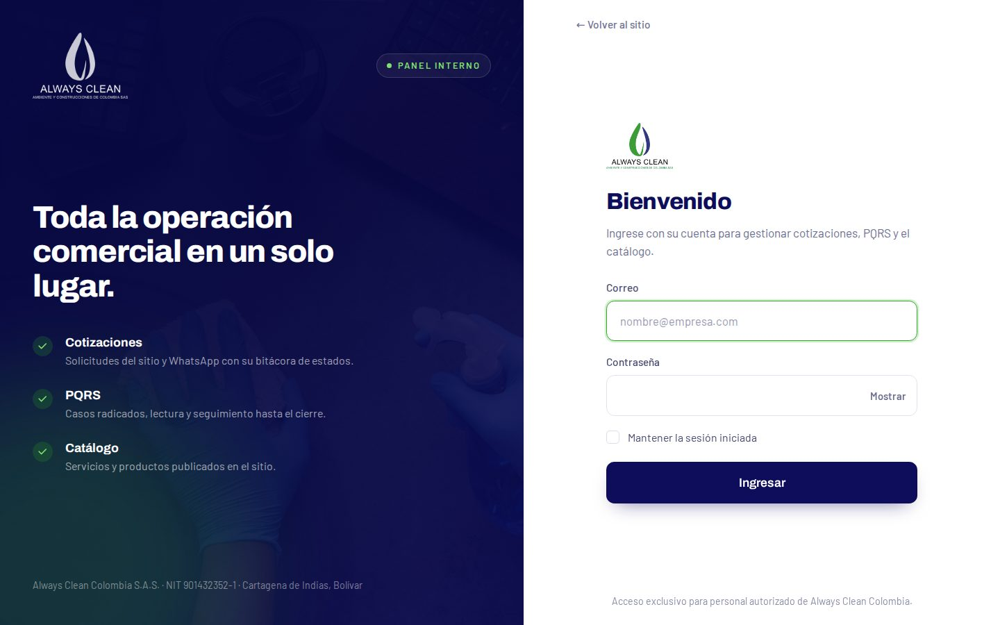
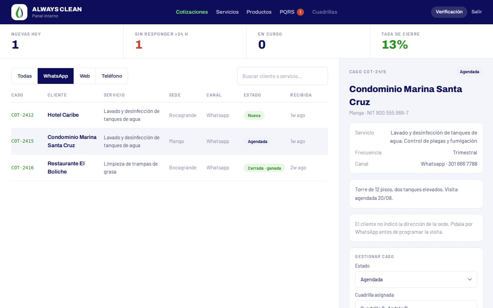

<p align="center">
  <picture>
    <source media="(prefers-color-scheme: dark)" srcset="public/images/logo-blanco.png">
    
  </picture>
</p>

<h1 align="center">Always Clean Colombia · Sitio web y panel interno</h1>

<p align="center">
  Sitio corporativo y herramienta de gestión comercial de <strong>Ambiente y Construcciones de Colombia S.A.S.</strong><br>
  Limpieza, desinfección, saneamiento básico y obras civiles en Cartagena de Indias y la costa Caribe.
</p>

<p align="center">
  
  
  
  
  
  
</p>

---

## Contenido

- [Descripción](#descripción)
- [Capturas](#capturas)
- [Funcionalidades](#funcionalidades)
- [Stack técnico](#stack-técnico)
- [Estructura del proyecto](#estructura-del-proyecto)
- [Puesta en marcha local](#puesta-en-marcha-local)
- [Configuración](#configuración)
- [Pruebas](#pruebas)
- [Despliegue](#despliegue)
- [Seguridad](#seguridad)
- [Licencia](#licencia)

## Descripción

El proyecto reúne dos aplicaciones sobre una misma base de código:

- **Sitio público**: presenta la empresa, su portafolio de servicios y productos, y concentra los canales de contacto: solicitud de cotización guiada, WhatsApp y radicación de PQRS.
- **Panel interno** (`/interno`): el equipo comercial y operativo recibe las cotizaciones, las sigue hasta el cierre, despacha las cuadrillas con la ubicación exacta de la sede, atiende los PQRS y administra el catálogo que se publica en el sitio.

## Capturas

| Inicio | Servicios |
| --- | --- |
|  |  |
| **Solicitud de cotización** | **Acceso al panel** |
|  |  |

<p align="center">
  <br>
  <sub>Bandeja de cotizaciones del panel interno (datos de ejemplo).</sub>
</p>

## Funcionalidades

### Sitio público

| Sección | Qué ofrece |
| --- | --- |
| **Inicio** | Propuesta de valor, servicios destacados, productos, bono de bienvenida y carrusel de clientes. |
| **Servicios** | Catálogo filtrable por línea de servicio y sector, con ficha de detalle por servicio. |
| **Productos** | Línea de productos propios. |
| **Nosotros** | Quiénes somos, misión, visión, valores, principios y sectores atendidos. |
| **Políticas** | Política integral de gestión (PO-SGI-001). |
| **Cotizar** (`/contacto`) | Formulario en tres pasos: servicios, sede y contacto. Autocompletado de direcciones con Google Places y pin en el mapa. Al enviar, la solicitud queda registrada y el cliente continúa la conversación por WhatsApp con su número de caso. |
| **PQRS** | Radicación de peticiones, quejas, reclamos y sugerencias con número de seguimiento y confirmación por correo. |

Además, la franja superior con NIT y datos de contacto y el botón flotante de WhatsApp aparecen en todas las páginas.

### Panel interno

| Módulo | Qué ofrece |
| --- | --- |
| **Cotizaciones** | Bandeja con indicadores (nuevas, sin respuesta en más de 24 h, en curso, tasa de cierre), filtros por canal y búsqueda. Flujo de estados de *Nueva* a *Cerrada · ganada/perdida*, asignación de cuadrilla, notas y bitácora de cambios. |
| **Ubicación de la sede** | Mapa del punto marcado por el cliente, indicador de ubicación exacta o aproximada, ruta en Google Maps y envío de los datos de la visita a la cuadrilla por WhatsApp. |
| **PQRS** | Bandeja de casos con marca de lectura automática, gestión de estado (radicado, en proceso, cerrado) y contador de casos sin leer en la navegación. |
| **Servicios y productos** | Alta, edición, activación y eliminación de lo que se publica en el sitio, con carga de imágenes. |

## Stack técnico

| Capa | Tecnología |
| --- | --- |
| Backend | Laravel 13 (PHP 8.2+) |
| Frontend | React 18 con Inertia.js 2 (sin API REST separada) |
| Estilos | Tailwind CSS 3 y `@tailwindcss/forms` |
| Build | Vite 6 |
| Base de datos | MySQL 8 (SQLite en memoria para pruebas) |
| Colas | Laravel Queue (envío de correos) |
| Almacenamiento | Disco configurable: `public` en local, S3 u Object Storage en producción |
| Servicios externos | Google Maps Platform (Maps JavaScript, Places API New, Maps Embed) y Cloudflare Turnstile |
| Pruebas | PHPUnit 12 |

## Estructura del proyecto

```text
app/
├── Http/Controllers/        Sitio público (Servicio, Producto, Contacto, Pqrs…)
│   ├── Interno/             Panel: servicios, productos, PQRS
│   └── Auth/                Ingreso al panel
├── Models/                  Servicio, Producto, Cotizacion, CotizacionEvento, PqrsCaso
├── Rules/                   Reglas de validación propias (Turnstile)
└── Support/                 Utilidades (cargas de archivos, IP del visitante)
config/company.php           Datos de la empresa compartidos con el frontend
database/
├── migrations/
├── seeders/                 Catálogo inicial y cotizaciones de ejemplo
└── sql/                     Scripts de base de datos para producción
resources/js/
├── Pages/                   Una página Inertia por vista (Home, Contacto, Interno/…)
├── Components/Site/         Componentes del sitio público
├── Components/Interno/      Componentes del panel
├── Layouts/                 SiteLayout e InternoLayout
└── lib/                     Utilidades de frontend (Google Maps, WhatsApp)
tests/Feature/               Pruebas de PQRS, cotizaciones e IP del visitante
```

## Puesta en marcha local

### Requisitos

- PHP 8.2 o superior, con las extensiones habituales de Laravel
- Composer 2
- Node.js 20 o superior y npm
- MySQL 8

### Instalación

```bash
git clone https://github.com/Yeizermarrugo/alwaysclean.git
cd alwaysclean

composer install
npm install

cp .env.example .env
php artisan key:generate
```

Configure la conexión a la base de datos en `.env` (`DB_*`) y luego:

```bash
php artisan migrate --seed   # crea las tablas y carga el catálogo y datos de ejemplo
php artisan storage:link     # expone las imágenes subidas desde el panel
```

### Ejecución

```bash
composer run dev
```

Levanta en paralelo el servidor de Laravel, el worker de colas, el visor de logs (Pail) y Vite. El sitio queda en <http://127.0.0.1:8000> y el panel en <http://127.0.0.1:8000/interno/login>.

> [!IMPORTANT]
> El seeder crea un usuario inicial para el panel. Cambie su contraseña o reemplácelo antes de usar la base de datos fuera de su equipo, y no ejecute `--seed` en producción sin revisar `DatabaseSeeder`.

## Configuración

Además de las variables estándar de Laravel, el proyecto usa:

| Variable | Uso | Obligatoria |
| --- | --- | --- |
| `UPLOADS_DISK` | Disco para las imágenes del catálogo (`public` o `s3`). | No (por defecto `public`) |
| `GOOGLE_MAPS_BROWSER_KEY` | Clave de navegador para autocompletar direcciones y mostrar mapas. Restrínjala por dominio (*HTTP referrer*). | No: sin ella la dirección se captura como texto |
| `GOOGLE_MAPS_MAP_ID` | Map ID para marcadores avanzados. | No (usa `DEMO_MAP_ID`) |
| `TURNSTILE_SITE_KEY` / `TURNSTILE_SECRET_KEY` | Verificación anti-bots de Cloudflare en los formularios públicos. | No: sin ellas se desactiva |
| `DB_PQRS_USERNAME` / `DB_PQRS_PASSWORD` | Usuario de base de datos de privilegios mínimos para el formulario de PQRS. | No: sin él usa la conexión principal |
| `IP_DESDE_CLOUDFLARE` | Toma la IP del visitante del encabezado de Cloudflare cuando el sitio está detrás de su proxy. | No (por defecto `false`) |

Los datos de la empresa que se muestran en el sitio (NIT, teléfonos, correos, WhatsApp, horario) se editan en `config/company.php`.

## Pruebas

```bash
php artisan test
```

La suite corre sobre SQLite en memoria (configurado en `phpunit.xml`), así que no toca la base de datos de desarrollo. Cubre el flujo de PQRS, el registro y la protección de cotizaciones, la ubicación de la sede y la resolución de la IP del visitante detrás de proxies.

## Despliegue

Plataforma prevista: **Laravel Cloud**. Pasos principales:

1. Crear la aplicación desde este repositorio y adjuntar una base de datos MySQL y un bucket de Object Storage (`UPLOADS_DISK=s3`).
2. Definir `APP_ENV=production`, `APP_DEBUG=false` y las claves reales de Turnstile y Google Maps.
3. Ejecutar migraciones y los seeders de catálogo (`ServicioSeeder`, `ProductoSeeder`).
4. Configurar un worker de colas para el envío de correos.
5. Registrar el dominio de producción en Cloudflare Turnstile y en las restricciones de la clave de Google Maps.

La lista de verificación completa está en [`CLAUDE.md`](CLAUDE.md#checklist-al-desplegar-laravel-cloud) y los pendientes en [`TODO.md`](TODO.md).

## Seguridad

- Los formularios públicos tienen límites de uso, verificación anti-bots y validación estricta en el servidor.
- Los correos automáticos no reproducen texto escrito por el visitante.
- El panel interno requiere autenticación y no está enlazado desde el sitio público.

Si encuentra una vulnerabilidad, escriba a **comercial@alwaysclean.com.co** en lugar de abrir un *issue* público.

## Licencia

© Ambiente y Construcciones de Colombia S.A.S. Todos los derechos reservados.

El código, los textos, las imágenes y la marca *Always Clean* son de uso exclusivo de la empresa. Los logos de clientes que aparecen en el sitio pertenecen a sus respectivos titulares.
